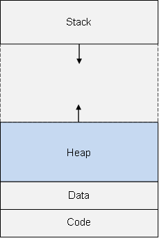
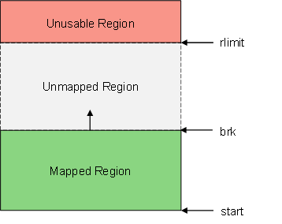
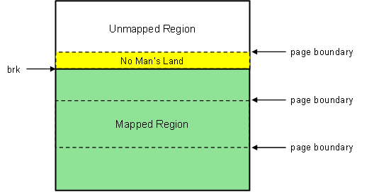
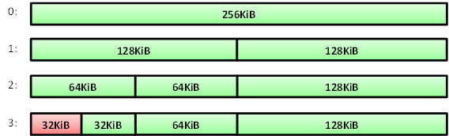
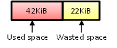
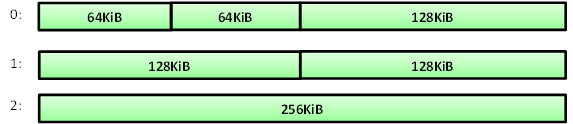

# Memory Allocator #


## 1 Introduction

Memory management is a fundamental issue in operating systems; one needs to consider the issue of memory fragmentation and the efficiency of dynamic allocation and deallocation in programs. 
Additionally, general-purpose memory allocators can become bottlenecks in high-performance applications, so custom memory managers can be written to fit a particular application's memory usage.

The aim is to implement a dynamic memory allocator using the buddy memory technique.
This will provide insight into how heap memory management for an application is performed and the reasoning behind allocator design.

Section 2 gives background on memory and Section 3 outlines the buddy memory allocator algorithm.

<br />
<br />

## 2 Background

Every process has its own virtual address space. Parts of this space are mapped to physical memory locations through address translation, which is managed by the memory management unit and the kernel. 
The address space is divided into several parts, primarily the stack, heap, and segments for code and static data.

<p align="center"></p>

### 2.1 Heap

The heap is a continuous region of the application's address space that is dynamically allocated during runtime by the program. It has three bounds:
- The start/'bottom' of the heap
- The 'top' of the heap, called the *break* or *brk*. It marks the end of the currently mapped memory region. This is a soft limit and can be increased using the ```brk()``` and ```sbrk()``` functions.
- A hard limit, an upper limit to the heap which the break cannot surpass. This can be managed through the getrlimit() and setrlimit() functions in &lt;sys/resource.h&gt;. You don't have to worry about it for this assignment.

<p align="center"></p>

### 2.2 No Man's Land

The virutal address space is mapped to physical space by means of pages. When ```sbrk()``` is called to increase the heap limit, the new space is mapped to physical memory in quanta of pages. 
These pages, however, are of a fixed size (usually 4KB), meaning the heap break won't always be placed at a page boundary. 
A space can therefore arise between the break and the next page boundary: "no man's land".
While accessing addresses beyond the break should trigger memory access violation errors ("bus error" or "segmentaition fault"), no errors are raised for memory accesses that are in "no man's land", outside of the mapped heap region but within an allocated page. We have to be warey that this can cause bugs to occur that are very difficult to track.

<p align="center"></p>

### 2.3 sbrk

Initially, the application's heap will not be allocated. The ```sbrk()``` function is used to increase the mapped region of the heap.
It has the following prototype:  
```void *sbrk(int increment)```

The function manipulates the position of the break, specifically by incrementing its position by a specified number of **bytes**. 
It returns the address of the **previous** break; so you can use ```sbrk(0)``` to get the current position of the break.

<br />
<br />

## 3 Buddy Allocator

The buddy memory allocator works by dividing memory partitions of specific sizes in order to fit the requested memory size suitably. The Linux kernel uses a modified version of the buddy system.  

Consider a binary buddy system where each block is a power of two. You start off with a single block of some maximum block size, say 2<sup>n</sup>. 
The system works by subdividing this block to best fit the sizes of memory allocations to powers of 2.
A block's buddy is its immediate neighbour formed during a split. Buddy blocks are merged when both are free, this reduces external fragmentation.

- The main advantages of buddy allocators are reduced external fragmentation and efficient block merging, since buddy blocks can be coalesced without needing to traverse the entire list looking for free blocks.
- The main disadvantage of buddy allocators is that they suffer from internal fragmentation, because allocations are rounded up to the nearest block size. 
For example, a 42KiB request will require a 64KiB block (see the allocation example below).

### 3.1 Allocation

Whenever a request for a memory allocation is performed:
1. The size of the request is rounded up to the next power of two, say 2<sup>k</sup>.
1. Search for the smallest block of size at least 2<sup>k</sup>.
    - If the block is exactly 2<sup>k</sup>, allocate the memory block.
    - Else:
        - Split the free memory block in half, creating two blocks.
        - Repeat until at the correct block size of 2<sup>k</sup>.
    
This uses a best-fit search to find the smallest block that can accomodate the requested size. Using a first-fit approach, choosing the first block we find in the list that is larger or equal to the requested size, would avoid searching the entire list of blocks but is less memory efficient because it leads to fragmentation.
    
### Example:

Consider a buddy system where we start with one block of maximum size 256KiB. We illustrate the allocation process using the algorithm outlined above:

- Space for 32KiB is requested in our program. The size is already a power of 2, so it isn't rounded up. Since the 256KiB block is too big, it is divided into two 128KiB blocks on step 1. We continue subdividing blocks until at the suitable size of 32KiB. That block is then marked as allocated.

<p align="center"></p>

- 42KiB is requested. The size is rounded up to 64KiB. We scan across the list of blocks: the first 32KiB blocks are too small, then we see the 64KiB block fits. The 128KiB block also fits but the 64KiB block is the 'best-fit', so it is allocated.

<p align="center"></p>

We see internal fragmantation here. Since the size was rounded up, 22KiB of space is wasted in the block.

<p align="center"></p>
    
<br />
    
### 3.2 Deallocation
    
Whenever memory is freed:
1. Ensure the memory location is valid to be freed.
1. Mark the block as free.
1. If the block's buddy is free:
    - Merge the two blocks.
    - Attempt to merge the buddy of the merged block.
    - Repeat until the upper block limit is reached (i.e. all memory is freed) or the buddy is not free.

### Example:

Consider the state of the heap from the previous example.

- A free is requested on the first 32KiB block. Its buddy is checked; since it is free, the two blocks are merged into a 64KiB block. The buddy of the merged block is not free, so we cannot merge again.

<p align="center"></p>

- A free is requested on the 64KiB block. Its buddy is free, so they are merged. We continue merging until at the maximum block size since all the buddies are free.

<p align="center"></p>

<br />
<br />


This assignment is due **20 October 2017, 11:59 PM**. Ensure your final code is in your private repository by then.

```
cd hw2
git add allocator.c allocator.h main.c
git commit
git push https://github.com/WITS-COMS2001/<student_number> master
```

**NOTE:**  
1. Remove any extraneous output from your code. Calling custom_malloc, custom_free, or custom_realloc should not print to stdout.
1. Ensure all files required for your submission to be compiled are included. That is, if we run ```make``` on only the files you submitted, it should compile without errors. If your code does not compile or run, you will get 0.  
1. Do not rename the custom_malloc, custom_free, or custom_realloc functions.
1. Do not rename the source files or alter the Makefile.
1. Keep your directory structure intact. That is, inside the top level of your repository you should have a folder called 'hw2' (case sensitive) with your source files.
1. You must use GitHub to submit your assignment, email submissions will not be accepted! 
